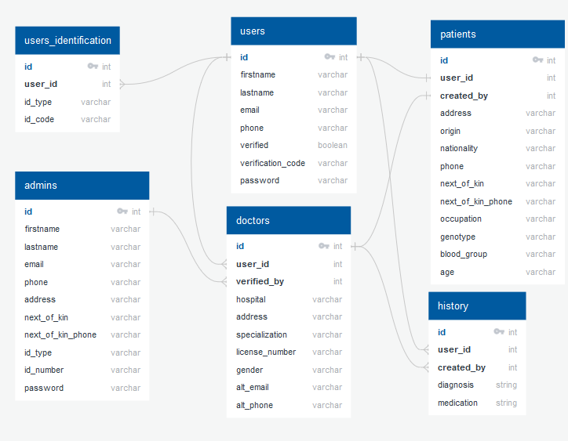

# Team-049-Group-A-BackEnd

[](https://www.codacy.com/gh/BuildForSDGCohort2/Team-049-Group-A-BackEnd?utm_source=github.com&amp;utm_medium=referral&amp;utm_content=BuildForSDGCohort2/Team-049-Group-A-BackEnd&amp;utm_campaign=Badge_Grade)

### Project Setup

1. Fork or clone the app and create a file named .env in the root of your project.

2. Copy the content of .env.example file to your .env file and fill in the database information as below:

```
DB_CLIENT=mysql
DB_HOST=localhost
DB_USER=root
DB_PASSWORD=your-chosen-db-password
DATABASE=emed
ACCESS_TOKEN_SECRET=******
REFRESH_TOKEN_SECRET=******
```

3. Create a database named **_emed_** in MySQL

4. Install the modules

```
npm install
```

5. Install the Knex CLI using NPM to help you run migration commands on your PC.

```
sudo npm install knex -g
```

6. Run `knex migrate:latest` to add the lates migration(s) tables in your database.
   **NB: for help with Knex commands, just type "knex" in your CMD tor Terminal**

7. ### Start the app:

**For Linux Systems**

```
node bin/www
```

**For Windows and Mac Systems**

```
node ./bin/www
```

### Database Design


